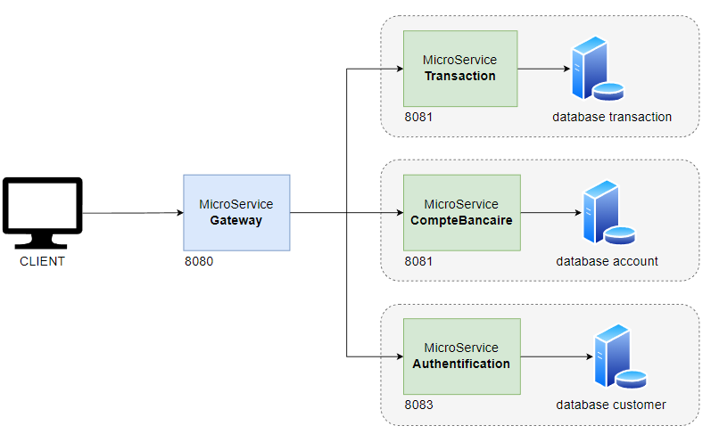

# Architecture Générale

Le diagramme suivant représente l'architecture qu'on souhaite mettre en place
- Un microservice pour les transactions
- Un microservice pour la gestion du compte bancaire
- Un microservice pour l'authentification
- Une Gateway

Chaque microservice dispose ensuite de sa propre API que nous détaillerons dans les chapitres suivants.