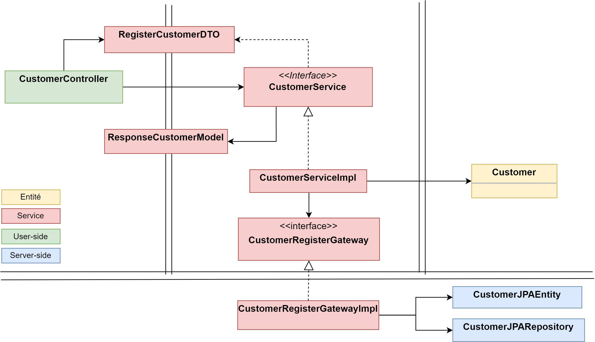

# Architecture d'un microservice

Nous avons évoqué l'architecture générale de notre application. Maintenant nous nous intéressons à l'architecture au sein d'un service. Nous une architecture par couche (layer) appelée *Clean Architecture*. 

> La Clean Architecture met l'accent sur la séparation des préoccupations et sur la dépendance des couches internes du système sur les couches externes. Elle favorise également l'indépendance des frameworks, des bibliothèques et des outils externes.

> Elle rend les systèmes logiciels maintenables, évolutifs et testables en isolant les détails d'implémentation dans les couches internes et en favorisant l'indépendance des couches externes.

[https://blog.cleancoder.com/uncle-bob/2012/08/13/the-clean-architecture.html
](https://blog.cleancoder.com/uncle-bob/2012/08/13/the-clean-architecture.html
)

## Brève introduction

### Entités
L'entité ne dépend de rien, sauf éventuellement d'autres entités. Elle contient des données (état) et une logique réutilisables pour diverses applications. Elles sont le cœur de notre application.

### Cas d'utililisation
Les cas d'utilisation interagissent avec les entités (dépendent d'elles) et détiennent la logique de l'application spécifique. Les UseCase peuvent être lié à des librairies. Par exemple avec une couche d'accès aux données

Dans notre application, le diagramme BPMN nous permet d'identifier facilement quels seront ces cas d'utilisation

### Adaptateurs
La couche d'adaptateur est une couche qui sert d'interface entre la logique métier (domaine) et les frameworks ou technologies externes tels que les bases de données, les services web, les systèmes de messagerie, accès aux bases de données, etc. Elle a pour rôle de traduire les données provenant de ces sources externes vers un format que la logique métier peut comprendre et utiliser, et vice versa.

[https://refactoring.guru/fr/design-patterns/adapter
](https://refactoring.guru/fr/design-patterns/adapter
)

### Librairies
Le cœur de l'application doit être indépendant des points d'entrée et des points de sortie (les librairies). En effet, si un framework ou une technologie externe ne répond plus aux besoins du système, il peut être remplacé facilement sans impacter la logique métier.

## Exemple
Chaque service suivra la même architecture que ci-dessous. Nous reviendrons en détail sur leur implémentation dans les chapitres suivants.

