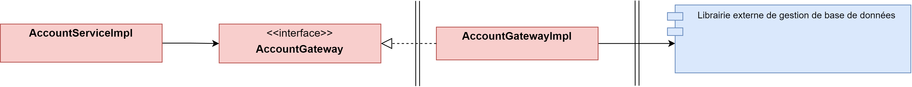

# Base de données

Pour pour persister des informations en base de données nous allons utiliser des librairies externes. Afin de protéger le coeur de notre application la communication avec la librairie externe se fera à travers d'un adaptateur.
Nous avons choisis cette solution car :
   - Si la librairie externe utilisée modifie son interface alors seule la classe Adaptateur devra être adaptée.
   - Si nous décidons d'utiliser une autre librairie qui ne respecte pas les spécification JPA alors seule la classe Adaptateur devra être adaptée.

**Ainsi avec cette option, le coeur restera inchangé quelques soient les choix et directive sur les librairies externes**



## Entités JPA
Dans notre application nous avons deux types d'entités
- Les entités du domaine
- Les entités JPA

Malgré leur forte similitude il est important deux les distinguer dans deux classes séparées. En effet, le coeur applicatif ne doit pas savoir comment les entités sont persistées (fichier, bases de données, etc ...). Ainsi, le lien entre les entités du domaine et les entités JPA sera fait par l'implémentation `AccountGatewayIml`

Ensuite, lorsque nous créons une entité JPA nous devons préciser :
- que c'est une entité via l'annonation `@Entity`
- la table où cette entité est persisté `@Table(nom_table)`
- par la suite nous vous spécifier des options sur certain attributs :
  - `@Id` pour l'identifiant
  - `@OneToOne` lorsque nous avons une relation de dépendance entre deux tables
  - etc ... 

```Java
@Entity
@Table(name = "account")
public class AccountJpaEntity {
	@Id
	@GeneratedValue(strategy = GenerationType.IDENTITY)
	private long id;

	@NonNull
	private Long customerId;

	@NonNull
	private String name;

	@NonNull
	private LocalDateTime createdAt;

	@OneToOne(cascade = { CascadeType.ALL })
	@NonNull
	private BalanceJPAEntity balanceJPAEntity;

	@Enumerated(EnumType.STRING)
	@NonNull
	private AccountTypeJPAEnum accountType;
}
```

```Java
@Entity
@Table(name = "balance")
public class BalanceJPAEntity {
	@Id
	@GeneratedValue(strategy = GenerationType.IDENTITY)
	private long id;

	@NonNull
	private double amount;

	@ElementCollection
	@CollectionTable(name = "transaction", joinColumns = @JoinColumn(name = "id"))
	@Column(name = "transactions")
	private List<Integer> transactionList;

	@NonNull
	private LocalDateTime lastUpdate;
}
```

```Java
public enum AccountTypeJPAEnum {
	CHEQUE, EPARGNE
}
```

## Le Repository
Il orchestre l'*entity manager* pour la persistance en base de données. Pour créer notre propre *repository* nous devons implémenter l'interface `JPARepository`.

En implémentant cette interface nous n'avons pas besoin d'écrire les méthodes de base comme `save`, `delete`, `getById`, etc ... elles ont déjà été implémentées. Cependant si nous souhaitons des méthodes plus spécifique à notre problème alors nous devons les écrires.

Par exemple, nous avons définie une méthode qui permet lister tous les comptes d'un utilisateur

```Java
public interface AccountJpaRepository extends JpaRepository<AccountJpaEntity, Long> {
	List<AccountJpaEntity> findByCustomerId(Long idCustomer);

	Optional<AccountJpaEntity> findByCustomerIdAndName(Long idCustomer, String name);

	List<AccountJpaEntity> findByCustomerIdAndAccountType(Long idCustomer, AccountTypeJPAEnum accountType);
}
```

Ce qui est encore plus fort, c'est que nous n'avons même pas besoin d'implémenter cette classe. En effet, en écrivant bien le nom des méthodes `find` + `By` + `something` où le `something` un attribut dans nos entités JPA, le framwork est capable d'écrire automatiquement la requête SQL précise.


## La Gateway
Elle traduit nos :
- entités JPA en entités domaine
- entités domaine en entités JPA

```java
public interface AccountGateway {

	void create(Long idCustomer, String accountName, AccountType accountType);
	void updateName(Long accountId, String newAccountName);
	void delete(Long idAccount);
	Account findByAccountId(Long idAccount);
	Account findByCustomerIdAndByName(Long idCustomer, String name);
	Account findByCustomerIdAndAccountId(Long idCustomer, Long idAccount);
	List<Account> findAllAccounts(Long idCustomer);
	List<Account> findByCustomerIdAndAccountType(Long customerId, AccountType accountType);
}
```

### La méthode create
**Objectif**
Créer un nouveau compte bancaire à un utilisateur. Elle prend donc en paramètre l'identifiant du client, le nom du compte à créer ainsi que son type. 

1. Crée l'ensemble des entités JPA nécessaire en utilisant les paramètres
2. Appelle la méthode `save` disponible dans `AccountJPARepository` (car elle implémente `JPARepository`)
   
```Java
@Component
public class AccountGatewayImpl implements AccountGateway {

	private final AccountJpaRepository accountJpaRepository;

	@Override
	public void create(Long idCustomer, String accountName, AccountType accountType) {
		accountJpaRepository.save(
            new AccountJpaEntity(idCustomer, accountName, LocalDateTime.now(),
				new BalanceJPAEntity(0.0, LocalDateTime.now()), AccountTypeJPAEnum.valueOf(accountType.name())));
	}
    ...
}
```

### La méthode findAllAccounts
**Objectif**
Récupérer tous les compte bancaires qu'un utilisateur possède

1. Appeler la méthode `findByCustomerId` créée précédement dans `AccountJpaRepository`
2. Convertir chaque AccountJPAEntity en Account. En effet, la partie métier ne traite que les entités du domaine
3. Retourner la liste

```Java
@Override
public List<Account> findAllAccounts(Long idCustomer) {
    List<Account> toReturn = new ArrayList<>();
    for (AccountJpaEntity accountJpaEntity : accountJpaRepository.findByCustomerId(idCustomer)) {
        toReturn.add(accountJpaToDomain(accountJpaEntity));
    }
    return toReturn;
}

private Account accountJpaToDomain(AccountJpaEntity jpaEntity) {
    return Account.builder().name(jpaEntity.getName())
            .accountType(AccountType.valueOf(jpaEntity.getAccountType().name()))
            .balance(balanceJpaToDomain(jpaEntity.getBalanceJPAEntity())).build();
}
```