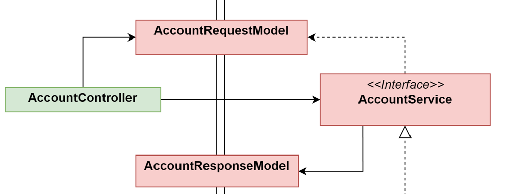

# Data Transfert Object

> A Data Transfer Object (DTO) is an object that is used to encapsulate data, and send it from one subsystem of an application to another.

Dans notre cas les DTOs vont permettre de transférer des informations entre le Contrôleur et le Service métier.
Ainsi, le Contrôleur :
1. Recupère les informations fournies par l'utilisateur (e.g. identifiant utilisateur, nom du compte, etc ...). 
2. Au lieu de transférer directement les informations au Service métier, il va les encapsuler dans un objet DTO.
3. Transmet de DTO au Service métier



## Exemple
Si on souhaite créer un nouveau compte bancaire :
1. nous devons fournir au Contrôleur *l'identifiant de l'utilisateur*, *le nom du compte à créer* et *le type du compte* (Epargne ou Chèque). Ces informations seront dans le *boby* de notre requête http
2. nous créons un nouvel objet de type `AccountRequestModel` en précisant la valeur des attributs en fonction du point précédent.
3. le Contrôleur appelle la méthode `accountService.create(accountRequestModel)` qui accepte seulement un DTO

> "DTO" et "Request/ResponseModel" représente la même notion.

## RequestDTO
Il fait la communication du `Controller` vers le `Service`

```Java
public class AccountRequestModel {
	private Long idCustomer;
	private Long idAccount;
	private String name;
	private String accountType;
}
```

## ResponseDTO
Il fait la communication du `Service` vers le `Controller`

```Java
public class AccountResponseModel {
	private String name;
	private String accountType;
	private double balanceAmount;
}
```

**Note**  
Nous pourrions créer plusieurs DTOs requêtes et réponses afin d'éviter d'avoir des attributs `null`. En effet, lors de la création d'un nouveau compte bancaire l'attribut `idAccount` sera `null`. 
Mais dans la construction de notre application nous souhaitons rester simple et n'utiliser qu'un seul DTO.