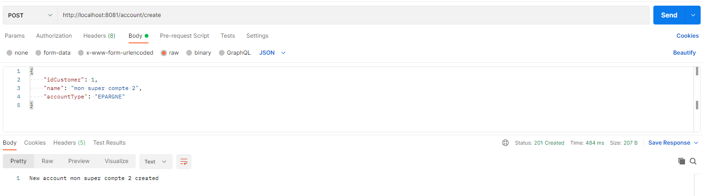
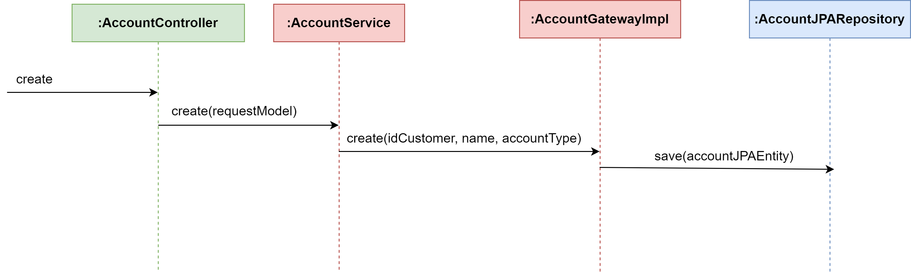

# Tester
Notre application est prête à être testée. La classe principale composée de la méthode `main()` est très classique.

```Java
@SpringBootApplication
@RestController
public class BankAccountApplication {

	public static void main(String[] args) {
		SpringApplication.run(BankAccountApplication.class, args);
	}

	@GetMapping
	public String hello() {
		return "Welcome to Bank Account";
	}
}
```

## Lancer notre application
Il suffit de lancer le programme Java via `Run As -> Java Application`. Un serveur accessible à l'adresse suivant `localhost:8081` est déployé. 

### Création automatique de la table
Lorsqu'on lance le serveur, Spring va nous créer les tables relatives au compte bancaire, à la balance et aux transaction. On retrouve la log suivante 

```text
Hibernate: 
    
    create table account (
       id  bigserial not null,
        account_type varchar(255),
        created_at timestamp,
        customer_id int8,
        name varchar(255),
        balancejpaentity_id int8,
        primary key (id)
    )
Hibernate: 
    
    create table balance (
       id  bigserial not null,
        amount float8 not null,
        last_update timestamp,
        primary key (id)
    )
Hibernate: 
    
    create table transaction (
       id int8 not null,
        transactions int4
    )
Hibernate: 
    
    alter table account 
       add constraint FK4ph46xeruid24i50n89i428j6 
       foreign key (balancejpaentity_id) 
       references balance
Hibernate: 
    
    alter table transaction 
       add constraint FKrn3ygljg7joxal9hsu695ltr6 
       foreign key (id) 
       references balance
```

## Tester notre application
On peut utiliser par exemple [Postman](https://www.postman.com/) pour effectuer des requêtes vers notre application.



## Diagramme de séquence
On représence ci-desosus l'ensemble des étapes necessaire à la création d'un compte bancaire

1. L'utilisateur appelle le contrôleur en lui transmettent un *body* contenant toutes les informations à enregistrer
2. Le Contrôleur transmet au Service les informations sous la forme d'un DTO
3. Le Service transmet à l'adapteur de la base de données 
4. L'adapteur de la base de données convertit les informations reçu en entité JPA puis appelle le Repository qui assurera la persistance

