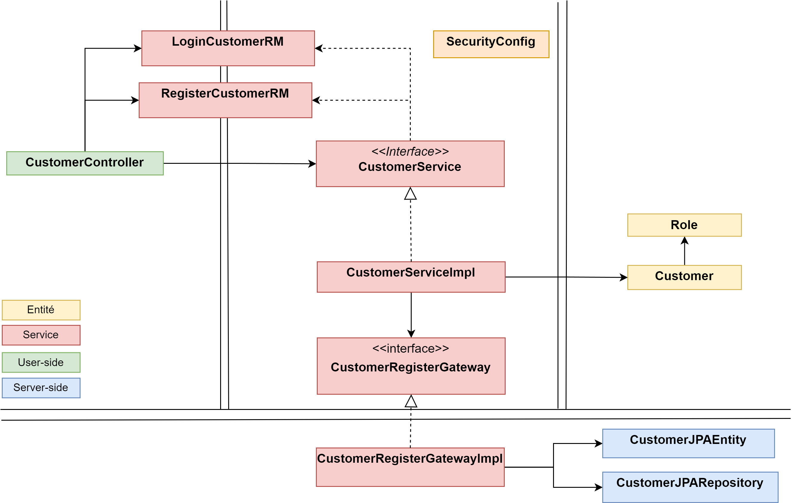

# Architecture
On reprend la même architecture que dans le chapitre précédent. Nous y avons juste rajouter dans la couche métier la classe `SecurityConfig` qui permet de mettre en place l'authentification dans notre application

