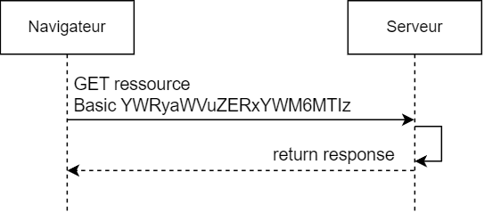

# Authentification Basic

Nous faisons une brève aparté sur l'*authentification basic* car elle permet de comprendre le fonctionnement des filtres et comment ils sont été mis en oeuvre dans Spring.

L'authentification basique fonctionne comme suit :
1. Le client demande d'accéder à une ressource et envoie ses identifiants de connexion sous forme d'une chaîne de caractères encodée en base64 qui contient le nom d'utilisateur et le mot de passe séparés par un deux-points.
2. Le serveur décode ensuite la chaîne encodée en base64 pour extraire le nom d'utilisateur et le mot de passe, puis vérifie si ces informations sont valides.
3. Si elles sont valides, l'utilisateur est considéré comme authentifié et peut accéder à la ressource protégée.

**Note**  
L'authentification Basic n'est pas sécurisée car les informations d'identification sont envoyées en clair dans l'en-tête HTTP.