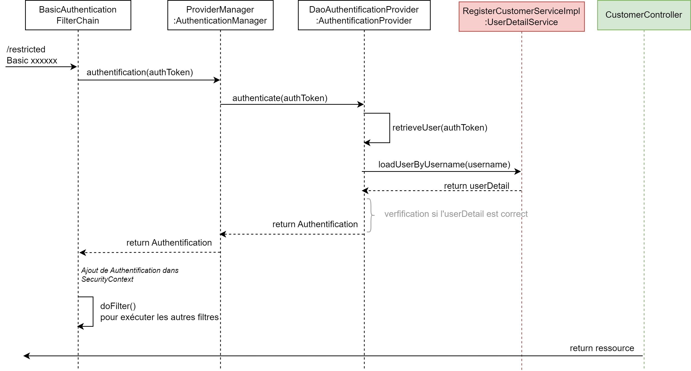
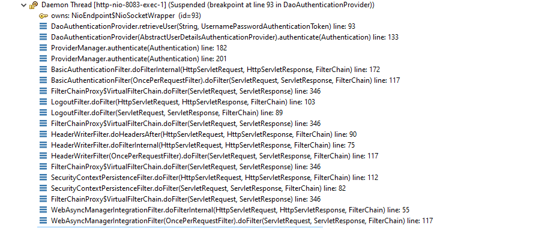

# Controleur

Nous pouvons nous passer de la page `/auth/login`, car l'utilisateur devra saisir ces identifiant pour se connecter à chacune des pages.
Ainsi pour accéder à `restricted` il devra donner son identifiant et son mot de passe.

```java
@GetMapping("/restricted")
public String retricted() {
    return "Welcome to Restricted page";
}
```

## Basic authentification avec Spring
La documentation [Spring](https://docs.spring.io/spring-security/reference/servlet/authentication/passwords/basic.html) explique très bien l'*authentification Basic*.


Spring fourni par défaut :
- un filtre `BasicAuthenticationFilter` intercepte la requête
- qui va crée le `UsernamePasswordAuthenticationFilter`
- qui va appeler `AuthenticationManager`. On retombe sur le diagramme de séquence décrit précédement, avec un appel au `DaoAuthenticationProvider`
- pour au final ajouter l'authentification au `SecurityContext`

**Conséquence**  
Ainsi, l'authentification (le login) est assuré en interne par Spring, nous n'avons pas besoin de coder de méthode `login()`.

## Diagramme de séquence 




## StackTrace



- Nous avons bien un ensemble de filtre exécutés, dont le `BasicAuthenticationFilter`.
- Qui va faire appel à une intance de `AuthenticationManager`, en l'occurance `ProviderManager`
- Qui lui, va appeler le `DaoAuthenticationProvider` afin de fournir une `Authentication` 
  
L'invocation du contrôleur est réalisée automatiquement après, une fois la *Security Filter Chain* "validée", c'est-à-dire que l'utilisateur est bien authentifié.