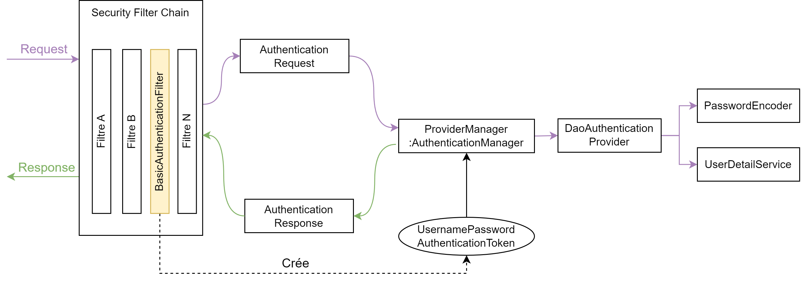

# Security Filter Chain
Nous devons mettre à jour notre *Security Filter Chain* pour qu'elle prenne en compte l'*authentification basic* en rajoutant les deux instructions suivantes


```java
  @Bean
  public SecurityFilterChain filterChain(HttpSecurity httpSecurity) throws Exception {
    httpSecurity.
        ...
        .and()
        .httpBasic(); /* authentication basic */
  }
```


## Mise en garde
Quelques tutoriel appèlent systémentatiquement `.httpBasic()`. Or, nous en avons besoin uniquement lorsque nous réalisation une *authentification basic*. Dans le chapitre précédent, la connexion a été codée manuellement. En effet, dans la méthode `login` du `RegisterController` nous préciserons :
- Comment créer `UsernameDetailService`
- L'appel à l'`AuthentificationManager`   
- L'ajout au `SecurityContext`   

En soit, si nous précisons *Basic* cela signifie qu'on n'a pas à coder les morceaux précédent. `BasicAuthenticationFilter` s'occupe d'appeler l'`AuthenticationManager` en lui fournissant l'`Authentication`

