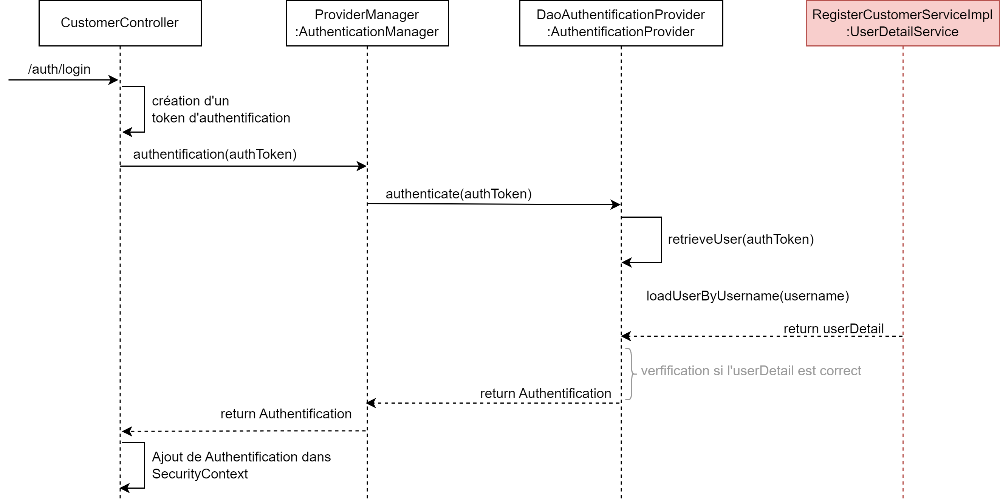

# Contrôleur

Il recoit les requête WEB et transmet l'information à la partie métier. 

## API
Chaque point d'entrée commence par `customer` suivi de
- `/registration` pour créer un nouveau compte utilisateur
- `/login` pour se connecter
- `/update/{id}` pour mettre à jour son compte (principalement le mot de passe)
- `/restricted` qui est une page accessible **uniquement** si on est authentifié

## Attributs

```java
@RestController
@RequestMapping("/customer")
public class CustomerController {

    // Fourni par le Bean développé dans SecurityConfig
    @Autowired
    private AuthenticationManager authenticationManager;

    private RegisterCustomerService registerCustomerService;

    ...
}
```

## S'enregistrer

L'enregistrement d'un nouvel utilisateur ne pose pas de problème particulier. Nous appelons simplements le service en lui fournissant le DTO.

```Java
@PostMapping("/register")
public ResponseEntity create(@RequestBody RegisterCustomerRequestDTO requestModel) {

    try {
        // Appel service métier en fournissant le DTO
        registerCustomerService.register(requestModel);

        return ResponseEntity.status(HttpStatus.CREATED).body("New account created");
    } catch (RegistrationMailAlreadyExist | RegistrationPhoneNumberAlreadyExist | RegistrationMDPmatch e) {
        return ResponseEntity.status(HttpStatus.FORBIDDEN).body(e.getMessage());
    }
}
```

## Se connecter

Néanmois la connexion est un peu plus complexe à mettre en oeuvre. Elle se traduit par le code suivant où nous devons
1. Créer un token d'authentification avec les informations founies par l'utilisateur. Pour rappel, la classe en charge de l'authentification est `AuthenticationManager` est son unique méthode accepte un objet de type `Authentication` (e.g `UsernamePasswordAuthenticationToken`).
2. Demander au gestionnaire d'authentification `AuthenticationManager` si les idenfiants sont corrects
3. Mettre à jour le `SecurityContext` avec les informations du client maintenant authentifié


```Java
@PostMapping("/auth/login")
public ResponseEntity<String> login(@RequestBody LoginRequestDTO loginDTO) {
    try {
        /* Créer un objet de type Authentication */
        UsernamePasswordAuthenticationToken token = new UsernamePasswordAuthenticationToken(loginDTO.getEmail(),
                loginDTO.getPassword());

        /* Appeler l'authenticationManager en passant l'objet précédent */        
        Authentication auth = authenticationManager.authenticate(token);

        /* Ajouter l'authentification au SecurityContext */
        SecurityContextHolder.getContext().setAuthentication(auth);
        
        return ResponseEntity.status(HttpStatus.ACCEPTED).body("User connected");
    } catch (AuthenticationException e) {
        return ResponseEntity.status(HttpStatus.FORBIDDEN).body(e.getMessage());
    }
}
```

### Diagramme de séquence
Le diagramme de séquence simplifié reprend les étapes réalisées en interne par le framework Spring pour réaliser une demande d'authentification



1. L'utilisateur effectue une requête sur `/auth/login`
2. La première instruction dans le Contrôleur crée un *token d'authentification*
3. Les informations saisies sont envoyées à un `AuthenticationManager`
4. Qui retransmets les informations à un objet de type `AuthentificationProvider`
5. `AuthentificationProvider` va :
   1. Appeler la méthode `retrieveUser` qui à partir du token d'authentification va retourner un objet de type `UserDetail`. L'`UserDetail` est l'objet Spring qui fournit des informations de base sur l'utilisateur.
   2. Appeler la méthode `loadUserByUsername` sur un objet de type `UserDetailService`. Et, précédement nous avons créer notre propre implémentation `RegisterCustomerServiceImpl`
   3. Ainsi, cette méthode (dont nous avons définie le fonctionnement juste avant) va aller chercher en base de données l'utilisateur et le renvoyer sous sa forme `UserDetail`
6. Nous avons donc récupérer notre utilisateur (il existe bien !). `AuthentificationProvider` va donc crée un objet de type `Authentification` en précisant l'attribut `authenticated = true`
7. Ce dernier objet et remonté jusqu'au Contrôleur qui va l'ajouter dans le `SecurityContext`

## Page avec restriction
Il n'y a aucune indication dans le Contrôleur qui informe que la page necessite une authentification.
La gestion a été définie dans la classe `SecurityConfig`.

```Java
@GetMapping("/restricted")
public String retricted() {
    return "Welcome to Restricted page";
}
```