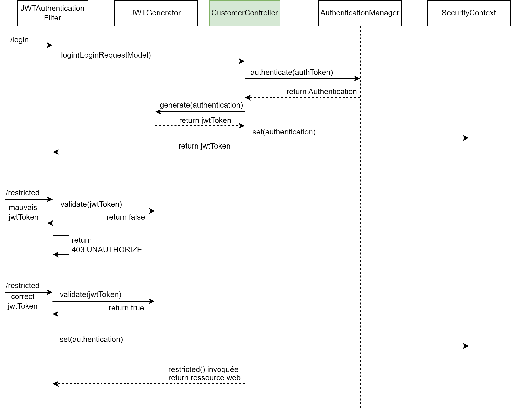

# Contrôleur

## Demande de connexion
Afin d'accepter le nouveau système d'authentification nous devons mettre à jour notre contrôleur. Nous en profitons également pour créer un ResponseModel qui sera renvoyé lors de la demande de connexion.

```java
public class LoginResponseModel {
    private String accessToken;
    private String tokenType = "Bearer ";

    public LoginResponseModel(String accessToken) {
        this.accessToken = accessToken;
    }
}
```


```java
@PostMapping("/auth/login")
public ResponseEntity<LoginResponseModel> login(@RequestBody LoginRequestModel loginDTO) {
    try {
        /* Créer un objet de type Authentication */
        UsernamePasswordAuthenticationToken token = new UsernamePasswordAuthenticationToken(loginDTO.getEmail(),
                loginDTO.getPassword());

        /* Appeler l'authenticationManager en passant l'objet précédent */        
        Authentication auth = authenticationManager.authenticate(token);

        /* Ajouter l'authentification au SecurityContext */
        SecurityContextHolder.getContext().setAuthentication(auth);

        /* Création du JWT token */
        String JWTtoken = jwtGenerator.generateToken(auth);

        /* Renvoie du JWT token au client */
        return new ResponseEntity<>(new LoginResponseModel(JWTtoken), HttpStatus.OK);
    } catch (AuthenticationException e) {
        return new ResponseEntity<>(null, HttpStatus.FORBIDDEN);
    }
}
```

## Page avec restriction

Il n'y a aucune indication dans le Contrôleur qui informe que la page necessite une authentification. Pour pouvoir accéder à cette page l'utilisateur devra fournir le token retourné par `login()`, et la `JWTFilterChain` s'assuera de sa validité

```java
@GetMapping("/restricted")
public String retricted() {
    return "Welcome to Restricted page";
}
```

## Diagramme de séquence




### Requête de connexion
Dans le cas du `/login`, la requête est intercepté par la *Security Filter Chain* et à un moment arrive dans le `JWTFilterChain` mais est bloqué par le `if` qui vérifie si un token existe (ce qui n'est pas le cas). Donc on exécute les filtres suivants (non représentés). Et on arrive enfin à la méthode `CustomerController#login()` dont nous avons déjà représenté le diagramme de séquence.

### Autres requêtes
Dans le cas d'une autre requête (e.g `/restricted`) la requête est intercepté par la *Security Filter Chain* et à un moment arrive dans le `JWTFilterChain`. 
1. Si le token est invalise, alors une exception est levée
2. Si le token est valide, alors nous ajoutons l'utilisateur au `SecurityContext`, ce qui autorise l'accès à la ressource

