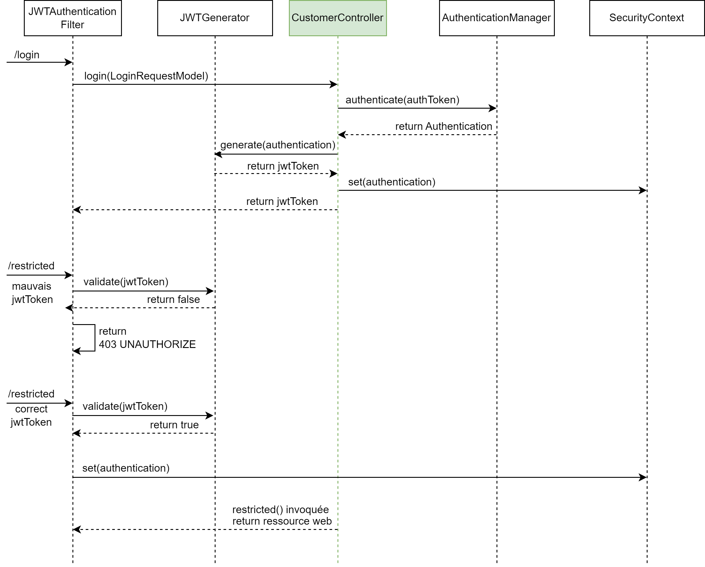
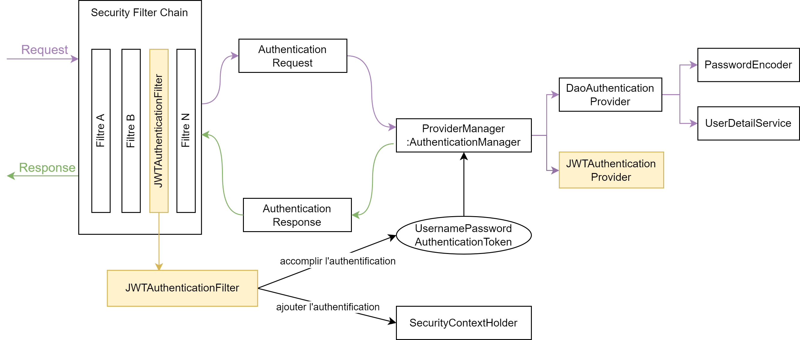

# Authentification JWT

Nous avons vu comment mettre en place une authentification dans Spring Security. Maintenant nous souhaitons mettre en place une authentification avec un token JWT.

## Fonctionnement JWT
> Les JSON Web Tokens (JWT) sont un moyen sécurisé de transmettre des informations entre deux parties. Ils sont généralement utilisés pour les applications Web et les services RESTful.

Voici comment se déroule l'authentification avec JWT entre un client et un serveur

1. **Authentification du client** : Le client fournit ses identifiants (par exemple, nom d'utilisateur et mot de passe) au serveur d'authentification pour s'authentifier.
2. **Création du JWT**: Si l'authentification est réussie, le serveur d'authentification crée un JWT qui contient les informations d'identification du client.
3. **Envoi du JWT au client** : Le serveur d'authentification envoie le JWT au client, qui peut maintenant l'utiliser pour accéder aux ressources protégées sur le serveur de ressources.
4. **Envoi du JWT au serveur** : Le client envoie le JWT au serveur de ressources dans l'en-tête Authorization de la requête HTTP. 
5. **Vérification du JWT** : Le serveur de ressources vérifie la signature du JWT. Si la signature est valide, le serveur de ressources extrait les informations d'identification du client à partir du JWT et vérifie que le client est autorisé à accéder à la ressource demandée. Si la vérification réussit, la ressource est renvoyée au client.
6. **Renvoie de la ressource** : Le serveur envoie au client la ressource demandée

Nous avons donc deux étapes biens distincte, ce qui va impacté la rédaction (ou plutot le fonctionnement) de notre code.

## Evolution de l'architecture
1. Dans la première architecture :
   - L'authentification était assurée par la méthode `login()`
   - La chaine de sécurité vérifiée si l'utilisateur était contenu dans le `SecurityContext` et si aucune exception n'était levée, alors l'utilisateur pouvait accéder à `/restricted`
2. Avec l'authentification via *Basic* :
   - Nous n'avons plus besoin de la méthode `login()`
   - L'utilisateur doit fournir ces identifiants à chaque appel
   - La *Security Filter Chain* avec `BasicAuthenticationFilter` autorisée ou non l'accès à la ressource protégée.
3. Avec l'authentification via *JWT*
   - Nous avons besoin d'une méthode `login()` pour founir un JWT token
   - Nous avons besoin de créer notre propre filtre pour vérifier si le token fourni par l'utilisateur est valide 

### Architecture

### Particularité
Il faut distinguer deux types de requêtes :
- Toutes les requêtes (e.g. `/restricted`)
- La requête de demande de connexion `/auth/login`

**Toutes requêtes**  
Toutes les requêtes sont interceptées par la *Security Filter Chain*. Lorsque nous exécuterons une requête classique où l'utilisateur est connecté alors la requête passera dans le filtre `JWTAuthenticationFilter`.

Ce filtre aura pour but de vérifier si le token fourni est valide. Dans le cas contraire, il reverra une exception avec *403 UNAUTHORIZE*

**Requête de connexion**  
La requête de connexion `/auth/login` est aussi interceptée par la *Security Filter Chain*. Cependant, `JWTAuthenticationFilter` traite que les requête ayant un token JWT (nous allons le coder tel quel). Or, quand on souhaite se connecter nous n'avons de token JWT. 

Par conséquence, notre requête qui contient *email* et *password* arrive au niveau de la méthode `login()` qui va devoir appeler l'`AuthenticationManager` et rajouter le token JWT obtenu au `SecurityContext`.

Donc le corp de la méthode `login()` ne sera pas vide, il devra générer un token JWT et le renvoyer au client