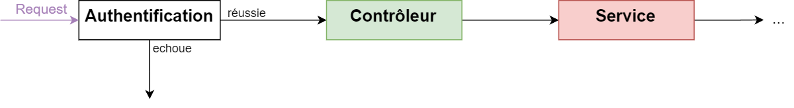
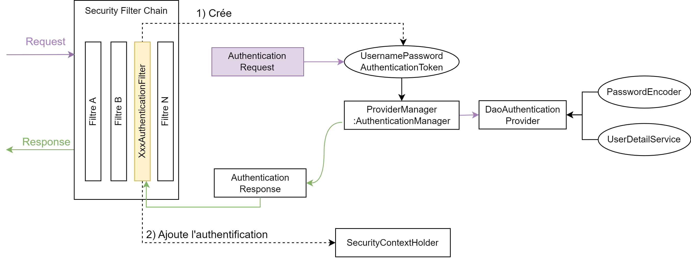
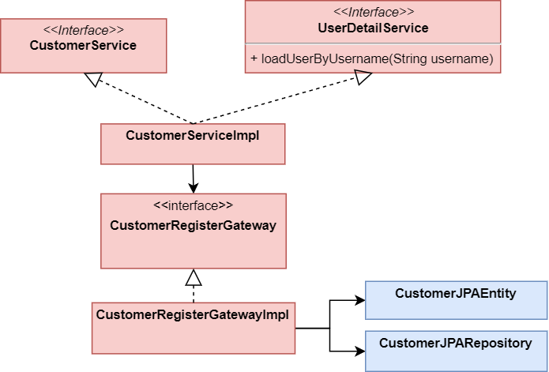

# Architecture Spring Security

Avant de coder la mise en place de la sécurité dans notre application, il est important de comprendre l'architecture mise en place par Spring pour réaliser l'authentification.

## Comment accéder à une ressource privée
L'authentification permet de restreindre l'accès une ressource qu'aux utilisateurs authentifiés. Pour ce faire Spring utilise le système suivant



- Lorsqu'une *requête* arrive, elle est **interceptée** pour authentifiée ou vérifier si l'utilisateur est authentifiée.
   - Si l'utilisateur ne réussit pas cette étape, alors une exception est levée par le bloc d'authentification. Par conséquence, le Contrôleur n'est pas invoqué, l'utilisateur n'accède pas à la ressource.
   - Si l'utilisateur est correctement authentifié, alors l'authentification déclenche l'appel au Contrôleur qui va retourner le contenu demandé.

### Détail du bloc d'authentification
Après avoir décrit le fonctionnement (reussite/echec) regardons en détail le fonctionnement du bloc d'authentification. C'est la partie la plus complexe, mais sa compréhension est priomardiale.



1. Lorsque la requête arrive elle est tout d'abord intercepté par la *Security Filter chain*. C'est une série de filtre qui vont vérifier si l'utilisateur peut accéder à la ressource.
2. Parmi ces filtres, un permet de vérifier l'authentification. Pour ce faire il va appeler un `AuthenticationManager` en lui fournissant un objet de type `UsernamePasswordAuthenticationToken` construit via la requête.
3. L'`AuthenticationManager` va appeler un `Provider` (e.g. `AuthenticationProvider`) qui retrouver l'utilisateur (chez nous en base de donnée). Pour ce faire, on doit lui injecté lors de son initialisation un `PasswordEncoder` et un `UserDetailService`.
4. Finalement si l'utilisateur est bien présent en base de données, une `Authentification` est retournée. Elle est stockée dans le `SecurityContext`
5. Et le dernier filtre passe la main au Contrôleur


## Définitions

### Security Filter Chain
Lorsque la requête est envoyé par l'utilisateur elle est interceptée par la *Security Filter Chain* qui est composée d'une série de filtre.

### L'Authentication Manager
> Il crée un Authorization ou lève une exception.

Si l'authentification n'est pas réussite une exception est levée, par conséquence le contrôleur n'est pas appelé et la ressource n'est pas accessible.

```java
public interface AuthenticationManager {
    Authentication authenticate(Authentication authentication) throws AuthenticationException;
}
```

. Cette interface est composée d'une seule méthode qui prend en paramètre un `Authentication` fournie est valide :
- Renvoie une `Authentication` (normalement avec `authenticated=true`) si elle est confirmée
- Lancer l'exception `AuthenticationException` si elle n'a pas pu être vérifiée


A noter, que notre requête doit donc être transformé en un objet de type `Authentication`, par exemple `UsernamePasswordAuthenticationToken` pour pouvoir être passé à l'`AuthenticationManager`. 

### DAOAuthenticationProvider

> Permet d'authentifier via un username et un password

Pour fonctionner il necessite qu'on lui injecte lors de sa construction un `PasswordEncoder` ainsi qu'un `UserDetailService`.

### UserDetailService

> Charge un utilisateur (nous en base de données) et le retourne sous la forme d'un `UserDetails`

```java
public interface UserDetailService {
    UserDetails loadUserByUsername(String username) throws UsernameNotFoundException;
}
```

Pour pouvoir récupérer un utilisateur en base de données, il va falloir lui "fournir l'accés" et coder nous même le corps de la fonction. En d'autre terme, cette fonction va être implémenté dans notre ``CustomerServiceImpl` où elle va appeler la gateway puis transformer l'entité domaine en `UserDetails`.

