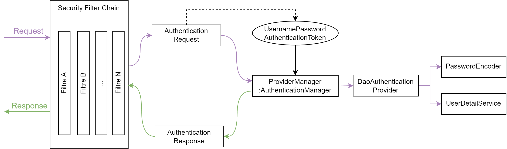

# Architecture Spring Security

Avant de coder la mise en place de la sécurité dans notre application, il est important de comprendre l'architecture mise en place par Spring pour réaliser l'authentification.



## Security Filter Chain
Lorsque la requête est envoyé par l'utilisateur elle est interceptée par la *Security Filter Chain* qui est composée d'une série de filtre.

## L'Authentication Manager
L'objet en charge d'accomplir l'authentification est l'`AuthenticationManager`. Cette interface est composée d'une seule méthode qui prend en paramètre un `Authentication`. L'objectif de cette méthode est de vérifier si l'objet `Authentication` est valide via les *Providers*.

```java
public interface AuthenticationManager {
    Authentication authenticate(Authentication authentication);
}
```
A noter, que notre requête doit donc être transformé en un objet de type `Authentication`, par exemple en un `UsernamePasswordAuthenticationToken`. 

## DAOAuthenticationProvider
Le `DAOAuthenticationProvider` necessite un `PasswordEncoder` ainsi qu'un `UserDetailService`. Son objectif est de retrouver si un utilisateur existe, par exemple en base de données.